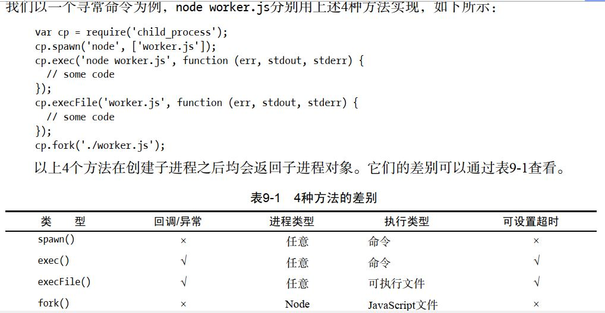

## child_process模块

- spawn
- exec
- execFile
- fork



## 进程间通信

- webWorker：通过onmessage回调和postMessage在线程间通信
```javascript
// parent
var worker = new Worker('worker.js')

worker.onmessage= function(event){
    document.getElementById('result').textContent = event.data
}

// worker.js

//do something
postMessage('...')
```

- node IPC通过message事件和send进程间通信

```javascript
var fork = require('child_process').fork
var n = fork('worker.js')

n.on('message', function (m) {
    console.log('message', m)
})
n.send({hello: 'workd'})

// worker.js
process.on('message', function(m){
    console.log('got message', m)
})
process.send({foo:'a'})
```
