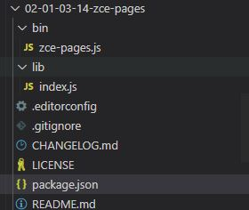
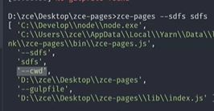

## 创建npm包
创建目录


package.json
```
{
     "files": [
    "lib",
    "bin"
  ],
  "main": "lib/index.js",
  "bin": "bin/zce-pages.js",
  "directories": {
    "lib": "lib"
  },
}
```
main表示包入口，作为依赖import后的返回结果可以从这个文件查看。比如，这个文件导出的是gulpfile的任务，在另一个项目import也就是得到了gulpfile的任务


## package读取项目的配置

1，获取当前工作目录，
2，读取配置信息，
3，合并配置信息

```javascript
const cwd = process.cwd()
const config= {
    ....
}
try{
    let loadConfig = require(`${cwd}/xxx.config.js`)
    config = Object.assign(config,loadConfig)
}catch(e){
}

```

## package使用

package有两种使用方式：

1. import
2. 命令行

### 增加命令行使用方式

1. package.json增加bin字段
2. 文件开头加上#!/usr/bin/env node

可以通过bin字段指定的命令，执行该模块，比如zce-pages

tips: 在package目录下npm link安装到全局

本例中，是希望在模块内调用gulp命令，指定模块内的配置文件，同时要保证工作目录是项目目录
```javascript
process.argv.push('--cwd')
process.argv.push(process.cwd())
process.argv.push('--gulpfile')
process.argv.push(require.resolve('..'))

require('gulp/bin/gulp')
```
增加命令行参数效果：


在cmd脚本中，运行js脚本，node.exe xx.js
在js脚本中,运行js脚本， 
```javascript
#!/usr/bin/env node 
require('xxx.js')
```

脚本开头增加shebang，可以省略node.exe/python
