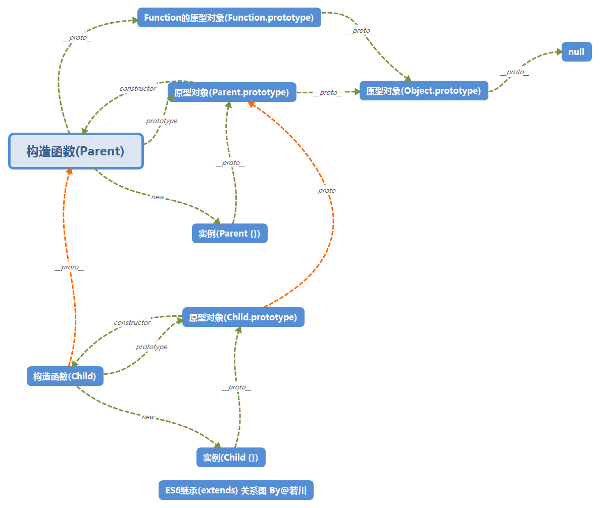

## js基础

1. new操作符

实现代码如下
```javascript
function newOperator(ctor) {
    if (typeof ctor !== 'function') {
        throw new Error('Constructor not a function')
    }

    const newObj = Object.create(ctor.prototype)
    const args = [].slice.call(arguments, 1)
    const returnObj = ctor.apply(newObj, args)

    const isObj = typeof returnObj==='object' && returnObj !== null;
    const isFunction = typeof returnObj === 'function'
    if (isObj || isFunction) {
        return returnObj
    }
    return newObj
}
```

详细解释见：https://juejin.cn/post/6844903704663949325

2. 实现bind

基本结论：

- bind是函数原型对象上，每个函数都可以调用
- 函数使用bind后，被调用对象是传入bind的第一个参数
- 当new 被bind后的函数时，this指向了新生成的对象

```javascript
Function.prototype.bindMock = function(target) {

  const originalFun = this;//this是调用bind的函数
  const args = [].slice.call(arguments,1)
  return function bound() {
    const boundArgs = [].slice.call(arguments)
    const finalArgs = args.concat(boundArgs)
    //this是new生成的对象
    if(this instanceof bound) {
      // new bound这种情况
      // orginalFun要绑定到新生成对象上调用
      const result = orginalFun.apply(this, finalArgs)
      const isObject = typeof result ==='object' && result!==null
      const isFunction = typeof result ==='function'
      if (isObject || isFunction) {
        return result
      }
      return this
    } else {
      return orginalFun.apply(target, finalArgs)
    }
    
    
  }
}
```

3. 实现apply、call

实现原理：哪个对象调用函数，函数中的this指向谁，将函数放到对象属性中去

```javascript
function getGlobalObject() {
  return this
}
Function.prototype.applyFn = function(target, argsArray) {
  //check
  if (typeof this !== 'function') {
    throw new TypeError(this+"is not function")
  }

  if (argsArray === null ||typeof argsArray === 'undefined') {
    argsArray =[]
  }

  if (argsArray !== new Object(argsArray)) {
    throw new TypeError('createListFromArrayLike called on non-object')
  }

  if (typeof target === 'undefined') {
    target = getGlobalObject()
  }

  var original = target['_fn']
  var hasOriginal = target.hasOwnProperty('_fn')
  target['_fn'] = this;
  var result = target['_fn'](...argsArray)//这一步可以通过生成函数兼容旧浏览器
  if (hasOriginal) {
    target['_fn'] = original;
  }
  return result;
}
```

2. 原生js怎么实现拖放

3. 说一下js中的类和java中的类的区别

js中是通过prototype模拟类

4. 说一下js中如何实现函数重载

通过检查参数的类型和数量并做不同的反应，模拟函数重载

5. 实现一下es6的extends
```javascript
function extends(child, parent) {
  if (typeof child !== 'function' && parent !== null) {
    throw new TypeError("super expression must either be null or a function")
  }

  child.prototype=Object.create(parent.prototype, {
    constructor: {
      value: child,
      writable: true,
      configurable: true
    }
  })
  if (parent) {
    child.__proto_ == parent
  }
}
```

6. js数据类型和存储方式,如何判断

简单： string, number, boolean, null, undefined, 存储在栈

复杂：function, object， 存储在堆

typeof

7. typeof [] 返回什么

返回object

8. 数组中一万个数据,访问第一个和最后一个效率会有什么差异,为什么

没区别，数组是按索引随机访问

9. forEach for in for of 的差异, js中遍历数组的方式

for in遍历对象

for of / forEach遍历数组

10. 如何改变this指向

bind/apply/call

11. js中函数是如何调用的

以函数形式调用；以对象方法调用；apply/call调用；构造函数调用

12. 说下原型和继承



13. js是单线程还是多线程,为什么这么设计

单线程，js主要是为了在浏览器中操作dom，如果多线程会有严重的同步问题

14. 类数组怎么转换成数组

[].slice.call()

15. new Array()接收的参数是什么

数字指定数组长度；

直接指定数组元素

16. 手写Promise.all

实现：
```javascript
new Promise((resolve,reject) =>{

})

const ayncInvokeFun = (fun) =>{
  let observer = new MutationObserver(fun)
  observer.observe(document.body, {
    attribute: true
  })
  document.body.setAttribute('a', Math.random())
}
const PENDING=0
const REJECTED=1
const RESOLVED=2
class Promise{
  constructor(fn) {
    this.state = PENDING
    this.successCallbacks=[]
    this.failCallbacks=[]
    this.data=this.err=null

    fn(this._resolve.bind(this), this._reject.bind(this))
  }
  _resolve(val){
    if (this.state===PENDING) {
      this.data=val
      this.state = RESOLVED
      let run = () => {
        while(this.successCallbacks) this.successCallbacks.shift()()
      }
      ayncInvokeFun(run)
    }
  }
  _reject(err) {
    if (this.state===PENDING) {
      this.err=err
      this.state=REJECTED
      let run = () => {
        while(this.successCallbacks) this.successCallbacks.shift()()
      }
      ayncInvokeFun(run)
    }

  }
  then(successCallback,failCallback){
    if (this.state===REJECTED){
      return new Promise((resolve,reject)=>{
        try{
          const x =failCallback(this.err)

          if (x instanceof Promise) {
            x.then(resolve, reject)
          }
        } catch(e) {
          reject(e)
        }
      })
    } else if (this.state===RESOLVED) {
      return new Promise((resolve,reject)=>{
        try{
              const x =successCallback(this.err)

              if (x instanceof Promise) {
                x.then(resolve, reject)
              }
            } catch(e) {
              reject(e)
            }
      })
    } else {
      return new Promise((resolve, reject) => {
        this.successCallbacks.push(()=>{
          try{
              const x =successCallback(this.err)

              if (x instanceof Promise) {
                x.then(resolve, reject)
              }
            } catch(e) {
              reject(e)
            }
        })

        this.failCallbacks.push(()=>{
          try{
              const x =failCallback(this.err)

              if (x instanceof Promise) {
                x.then(resolve, reject)
              }
            } catch(e) {
              reject(e)
            }
        })

      })
    }
    
  }
  //reject/resolve都会调用，返回的promise存的是当前promise的值
  finally(callback) {
    return this.then(val=>{
      return new Promise.resolve(callback()).then(()=>val)
    },
    val=>{
      return new Promise.resolve(callback()).then(()=>val)
    },
    )
  }

  static resolve(value) {
    if (value instanceof Promise) {
      return value
    }
    return new Promise(resolve=>resolve(value))
  }

  static all(arr) {
    let result =[]
    let count =0
    return new Promise((resolve,reject)=>{
      for (let i=0;i<arr.length;i++) {
        let p= arr[i]
        if (p instanceof Promise) {
           p.then(val=>{
            result[i]= val
            count++
            if (count === arr.length) {
              resolve(result)
            }
          }, err=> reject(err))
        } else {
          count++
          result[i] = arr[i]
          if (count === arr.length) {
              resolve(result)
            }
        }
       
      }
    })
  }
}
```

17. Promise中用了什么设计模式

发布订阅

18. Promise都有哪些状态

rejected/resolved/pending

19. 手写一个Scheduler类,实现并发控制

```javascript
class Scheduler {
  add(promiseCreator) { ... }

  // ...
}

const timeout = (time) => new Promise(resolve => {
  setTimeout(resolve, time)
})

const scheduler = new Scheduler()
const addTask = (time, order) => {
  scheduler.add(() => timeout(time))
    .then(() => console.log(order))
}

addTask(1000, '1')
addTask(500, '2')
addTask(300, '3')
addTask(400, '4')
// output: 2 3 1 4

// 一开始,1、2两个任务进入队列
// 500ms时,2完成,输出2,任务3进队
// 800ms时,3完成,输出3,任务4进队
// 1000ms时,1完成,输出1
// 1200ms时,4完成,输出4
```

实现：
```javascript
class Scheduler{
  limit = 2
  constructor(){
    this.tasksCount=0
    this.queue=[]
  }
  add(promiseCreator) {
    if (this.tasksCount < this.limit) {
      this.tasksCount++
      return new Promise(resolve=>{

        promiseCreator().then(val=>{
          this.tasksCount--
          if (this.queue.length) {
            this.tasksCount++
            this.queue.shift()().then(val=>{
              this.tasksCount --
            })

          }
          resolve(val)})
      })
    } else{
      return new Promise(resolve=>{
        this.queue.push(()=>{
          return promiseCreator().then(resolve)
        })
      })
    }
  }
}
```

20. promise并发控制

promise.all加limit的实现思路： https://juejin.cn/post/6844904095376146446

21. Object.create实现

```javascript
function createFun(o){
    //错误检查
    function Empty(){}
    Empty.prototype=o
    return new Empty()
}
//https://developer.mozilla.org/zh-CN/docs/Web/JavaScript/Reference/Global_Objects/Object/create#polyfill
```

存在弊端： 所有通过Object.create出来的对象共享原始obj属性

22. Object.create传null和{} 有啥区别吗

Object.create(null) 会创建一个真正的空对象，并没有继承Object原型链上的方法

23. 手写promise 

见上

24. new Promise返回的实例和实例then方法执行后返回的promise是一个吗

不是

25. 实现数组扁平化函数flat

```javascript

function reduceDim(arr, depth){
  let curQueue=[] 
  let nextQueue=[]
  curQueue = curQueue.push(arr)
  let curDepth =0
  let hasNext=true
  while(hasNext) {
    hasNext=false
    while(curQueue.length) {
      let item = curQueue.shift()
      if (item instanceof Array) {
        for (i of item){
          nextQueue.push(i)
          hasNext=true
        }   
      }else {
        nextQueue.push(item)
      }
    }
    curDepth++
    if (curDepth===depth) return nextQueue
    let tmp = curQueue 
    curQueue = nextQueue
    nextQueue = tmp
  }
  return curQueue;
}
Array.prototype.flatFn = function (depth) {
  let result =[]

  if (depth===undefined) depth=1
  if (depth ==0) return this
  const originArray = this;
  const length = originArray.length
  for (let i=0;i<length;i++) {
    let item = originArray[i]
    if (item instanceof Array) {
      let sub = reduceDim(item, depth)
      console.log()
     result=result.concat(sub)
    } else {
      result.push(item)
    }
  }
  return result
}


```

26. js为什么会有回调地狱呢，为什么java没有回调地狱

js是单线程的，对于异步操作采用的是回调函数的方式实现，当多个异步操作相互依赖时就会产生回调地狱。java中主流的代码写作方式是同步的

27. 防抖节流区分,手写
```javascript
// throttle
function throttle(fn, delay) {
  let timer = null
  let busy=false
  return function(){
    if (!busy){
      busy=true
       timer=setTimeout(()=>{
      fn()
      busy=false
    }, delay)
    }  
  }
}
// debounce
function debounce(fn,delay){
  let timer =null
  // let busy=false
  return function () {
    // if (busy) {
      clearTimeout(timer)
    // }
    // busy=true
    timer =setTimeout(()=>{
      fn()
      // busy=false
    }, delay)
  }
}
```

28. 实现map,reduce

29. 如何区分函数是new调用还是直接调用

直接调用this指向调用的对象，new this指向生成的对象


js灵魂之问(上):https://juejin.cn/post/6844903974378668039
js灵魂之问(中):https://juejin.cn/post/6844903986479251464
js灵魂之问(下):https://juejin.cn/post/6844904004007247880

## 浏览器

1. 从地址栏输入地址到页面回显,都发生了什么

浏览器解析出地址；dns解析；建立tcp连接；浏览器发送数据，等待响应；
服务器处理请求响应；渲染HTML

2. 解释下重绘和回流

浏览器解析HTML生成dom树，解析css生成css树，dom树和css结合构建出render树。
回流：render树中元素因为尺寸，布局，隐藏等改变，需要重新构建

重绘：当更改元素不影响元素尺寸，布局，仅仅影响外观的渲染

3. 说下浏览器事件循环

浏览器中执行js是单线程，解析js脚本时，会一个宏任务到栈中，代码中会注册事件，同步代码执行完毕，过程中遇到的异步代码比如setTimeout,promise等会放到宏任务和微任务队列中，下一轮执行。当同步代码执行完后，出栈。执行微任务队列中所有任务，然后是宏任务，直到所有任务执行完。

4. 浏览器缓存(http缓存),如何实现

浏览器缓存分强制缓存和协商缓存，强制缓存由expires和cache-conctrol两个字段控制；协商缓存由if-modified-since/last-modified, if-none-match/etag控制。

浏览器第一次发送请求，浏览器会将缓存标识和结果一并返回。浏览器会根据缓存标识缓存结果。当再次发送请求，先去缓存中取，缓存生效则结束。缓存失效，会向服务器发送请求，请求头中携带结果的缓存标识比如(if-none-match或者if-modified-since)，服务器判断后允许使用协商缓存则返回304，否则返回响应数据响应200

字段头：

expires和Cache-control都是响应头中控制网页缓存的，
expires是http1.0时的头， Cache-Control是http1.1中的规则

参见：https://juejin.cn/post/6844903593275817998

5. 说下jwt,知道jwt有哪些缺点吗

传统上，身份认证是使用cookie/session，用户发送用户名密码，服务器验证成功后生成session存储在某个地方，然后响应中返回cookie，之后客户端每次请求携带cookie。这种方式身份信息存储在后端，客户端只有sessionId，但是不便于扩展。

jwt是将身份信息存储在客户端的方式。客户端发送请求认证成功后，服务器生成token返回，之后客户端每次请求携带token。通常token是放在请求头的Authorization中发送。

token的格式是分为3部分，通过.分隔。第一部分是元信息，记录使用的算法等，第二部分是payload，记录身份信息；第三部分是签名，用于防止篡改。因为token不是加密的，所以不能携带私密信息。如果泄露了，就完蛋了。


参见：http://www.ruanyifeng.com/blog/2018/07/json_web_token-tutorial.html

6. 知道内存碎片怎么产生的吗 v8


7. requestAnimationFrame 和 requestIdleCallback了解吗

浏览器一般1秒刷新60次，如果使用setTimeout实现动画，难以保证调用时机。requestAnimationFrame专为此而生。requestAnimationFrame 接受一个回调函数，浏览器会在下次重绘前调用。当requestAnimationFrame 运行在后台标签或隐藏的iframe时会暂停执行。

requestIdleCallback让浏览器在空闲时间执行优先级较低的任务。

8. 说下跨域

浏览器的同源策略导致了跨域问题，同源策略限制了从一个源加载的脚本、文档和另一个源进行交互。主要为了防止csrf和不同网址脚本获取dom元素。

解决跨域： cors

cors请求分为简单请求和非简单请求

非简单请求是： 请求方法是put、delete等或content-type是application/json。非简单请求发送前，浏览器会自动发送预检请求，只有通过后，才会发送非简单请求。

简单请求浏览器会在请求头中加上origin参数，服务端会返回Access-Control-Allow-xxx头部


跨域cookie的处理：

服务器返回的响应头部设置Access-Control-Allow-Credentials为true, 客户端xhr请求上设置xhr.withCredentials = true;

参见：https://www.ruanyifeng.com/blog/2016/04/cors.html

https://segmentfault.com/a/1190000015597029

## http

1. get和post的区别

2. post请求有几种方式触发

3. post的ContentType类型有哪些

4. 说一下http和https的区别

5. https的tls了解吗

6. http中间人劫持了解吗?如何解决呢?(说了https)

7. 为什么https可以做到避免中间人劫持?(说了加密层tls)

8. 展开说一下tls握手(对称,非对称,对称+非对称的组合)

9. 加密套件指的是?(举例了AES)

10. 业务中的安全问题有没有遇到过?怎么解决的?(说了base64,cors,xss,csrf,cookie的httponly和samesite属性)

神三元的http灵魂之问:https://juejin.cn/post/6844904100035821575

## css

1. 页面适配方案:百分比,flex,vh,vw

2. css弧形永动动画实现

3. css 1px像素适配

4. css设置div宽高比3:4 padding-bottom:75%

5. 说下transform 和transition

6. css盒模型吗

7. box-sizing中border-box 和content-box的区别

css世界:https://www.cssworld.cn/
flex小青蛙:http://flexboxfroggy.com/
flex阮一峰博客:http://www.ruanyifeng.com/blog/2015/07/flex-grammar.html

## 多端

1. 有没有接触过移动端,小程序,h5等方向


## React

1. react-dnd拖放的核心API

2. react diff 算法复杂度是多少

O(n), 同层比较

3. 如何实现路由监听

路由组件可以直接获取到history，location等路由属性，通过hook或者history的监听函数可以监听。
其他组件，可以通过react-router的hook API获取到路由属性

4. react生命周期

常见的：

挂载： constructor--》render--》componentDidMount

更新：render => componentDidUpdate

卸载： componentWillUnmount

不常见：

挂载： constructor--》static getDerivedStateFromProps--》render--》componentDidMount

更新： static getDerivedStateFromProps =》 shoudComponentUpdate => render => getSnapshotBeforeUpdate

=> componentDidUpdate

更新阶段废弃： componentWillUpdate， componentWillReceiveProps


5. 说下react-router源码你看完后印象深刻的部分

6. setState更新是同步还是异步

异步，要获取改变后的状态可以通过callback或生命周期函数

7. 类组件和函数组件,什么时候用类组件

不知道

8. 选择hooks的优点

复用组件逻辑；相关逻辑放在一起，不会分散在各个生命周期中；没有this指向问题

9. 为什么不要在循环、条件语句或者嵌套方法中调用Hooks

因为hook依赖调用顺序保持一致。

10. 为什么要用hooks,解决了什么问题

同优点

11. react函数组件和类组件触发更新的方式有哪些

setState, forceUpdate


12. react的强制更新有了解吗

一般，当组件props或者state发生变化时，组件将重新渲染，如果render方法依赖其他数据，可以调用forceUpdate强制刷新。调用forceUpdate会跳过组件shouldComponentUpdate方法

13. react在一秒内点击按钮多次(+1),如何获取最后一次的新状态

14. react-router权限路由写一下


15. react合成事件了解吗？

react没有将事件绑定在dom上，而是绑定在document上，通过事件冒泡的方式委托执行。ReactEventListener维持了一个映射所有组件内部事件监听和处理函数，负责事件组成和分发。

在生命周期函数中通过addEventListener使用原生事件

16. 这些事件处理函数最终挂载到了哪？

事件都挂载到document上，通过React的ReactEventListner注册分发事件

17. react中如何阻止冒泡

stopPropagation可以组件React合成事件冒泡，如果要阻止原生事件冒泡，必须通过addEeventListener这种原生事件阻止

18. react15和react16更新机制的差异

react15架构由协调器（Reconciler）、渲染器（Renderer）组成，react16由协调器、渲染器、调度器组成。react15采用的是基于栈的递归的更新方式，不可中断，react16采用的是基于fiber的更新方式，可中断

19. 为什么react16架构升级后就能中断更新,根据什么决定是否中断

react16采用了Fiber树的架构，使用循环去更新，所以可以中断，根据优先级

20. react中调和的部分是在哪个包?有看过实现吗

21. 类组件如何实现逻辑复用？

高阶组件

22. react权限路由实现

全局组件、模仿vue加一下meta到路由中去

23. 前端路由实现原理(对比react,vue)


24. 单页面应用和传统服务端渲染的差异比较

单页应用页面切换都是由浏览器完成；ssr由服务端渲染，首屏渲染速度快，利于seo

25. 前端页面性能优化

React可以通过下面方法：打生产包；虚拟列表；纯组件、避免不必要的渲染；分析组件渲染

26. 说下react的key

react在比对时分为两种情况：有key和没key。没key就按照索引依次比较，不同就重新创建dom；使用key，会复用已有的具有相同key的元素。

28. 说下react-redux干了什么事

29. mapStateToProps的第二个参数作用

卡颂的react技术揭秘:https://react.iamkasong.com/
若川的源码系列:https://juejin.cn/user/1415826704971918/posts
难凉热血的vue源码分析:https://nlrx-wjc.github.io/Learn-Vue-Source-Code/

## 其他

1. 前端缩略图(截图)方案是什么

FileReader readAsDataURL

https://blog.csdn.net/adley_app/article/details/78539028

2. git reset 和git rebase了解吗

git reset: reset head to specified state
包括3种模式，soft、mixed、hard，默认是mixed，只保留工作区内容，soft会撤销history，保留工作区和stage区

参见：https://www.jianshu.com/p/c2ec5f06cf1a

git rebase多个分支合并后，输出git log是有分支的，不好看，git rebase会将带分支的历史变为直线


3. nginx负载均衡配置

upstream设置分发的集群，proxy_pass设置转发组名

参见：https://www.jianshu.com/p/4c250c1cd6cd

## 其他库源码

1. axios源码整体架构

2. 手写一个koa2的compose，koa-compose实现

将多个middleware合并成一个函数，middleware签名类似 （context,next),返回的函数的签名和middleware一样，返回的函数会挂载到http模块中去

```javascript
function compose(middlewares) {
  // do some check wheather param is array

  return function (context, next) {
      let index=-1
      return dispatch(0)

      function dispatch(i) {
        if (i<=index) return Promise.reject(new Error('wrong '))

        let fn = middlewares[i]
        if (!fn) return Promise.resolve()
        try{
          return Promise.resolve(fn(context, dipatch.bind(null,i+1)))
          

        }catch(err){
          return Promise.reject(err)
        }


      }
  }
}
```

3. koa2中间件和redux中间件比较,原理

  ```javascript
  //接受一个object
  function combineReducer(reducers) {
    return function (state, action) {
      let nextState = {}
      for(let reducer in reducers) {
        nextState[reducer] = reducers[reducer](state[reducer], action)
      }
      return nextState

    }
  }

  // redux compose
  function compose(fns) {
    return funciton(dispatch) {
      for (let i=fns.length-1;i>=0;i--) {
        dispatch = fns(dipatch)
      }
      return dispatch
    }
  }

  // redux compose2
  function compose(fns) {
    return function(dispatch) {
      return fns.reduce((a,b)=>(...args)=>a(b(...args)))
    }
  }
  ```

4. koa2的洋葱模型和redux中间件的洋葱模型一样吗

一样

5. 两个compose的大概实现,reduce的妙用

6. 说说你对koa2中间件的理解

7. 某些接口允许跨域,某些不允许,如何实现?能不能使用koa2中间件的方式实现一下?


8. koa2中ctx.set的等价写法

## node

1. node单线程容易崩溃,怎么维护服务的

cluster

2. pm2内部机制了解吗

3. cluster了解多少

4. node转buffer输出字符串会比直接string输出快,你的依据是什么？

5. 用node如何实现一个带压缩和缓存的http-server？

6. node中加载相同模块,会重复打印吗
```javascript
//a.js 
function foo() {
    console.log('foo'); // 
 }
foo();
//b.js
require('./a.js');
require('./a.js');
//node b.js
```

7. 如何设计这套缓存

8. http模块起一个服务,如果想修改请求体并转发给另一个服务,怎么实现

## webpack

1. webpack动态加载

```javascript
const home = ()=>import(/* webpackChunkName: 'components' */'home')
```
import会返回promise，动态加载的模块会单独打包，通过魔法注释可以指定webpackChunkName


2. webpack常用配置

五个概念：入口、输出、loader、plugin、mode

入口设置只有两种case：单入口和多入口

输出：可以指定path和filename

3. webpack插件写过吗

plugin是一个包含apply方法的js对象，compiler会传入参数

4. webpack常用插件

CopyWebpackPlugin拷贝文件到build目录

HTMLWebpackPlugin生成html，并且加入生成的bundle

DefinePlugin定义环境变量

5. 如何将css内容插入到页面上(style-loader)

css-loader和style-loader

6. webpack有哪些优化方案，loader和plugin有写过吗

将mode设为production启用minification和tree shaking

使用SplitChunksPlugin分离公共模块

动态导入

预取和预加载

## 算法

1. 数组去重怎么实现,不用set怎么实现

2. 二叉树层序遍历和s形的层序遍历

3. 如何在从左到右升序,从上到下升序,每一行第一个元素大于上一行最后一个元素的二维数组中查找某个数字的索引?如果是一维数组呢?
4. 算法3:二分法的实现
5. 算法4:单链表反转

6. 给定一串数字,求它全排列结果

数据结构与算法之美:https://time.geekbang.org/column/intro/100017301
政采云团队的博客--算法篇:https://101.zoo.team/
天天的前端算法总结:https://juejin.cn/post/6900698814093459463
ssh的前端算法进阶指南:https://juejin.cn/post/6847009772500156429
修言算法小册:https://juejin.cn/book/6844733800300150797