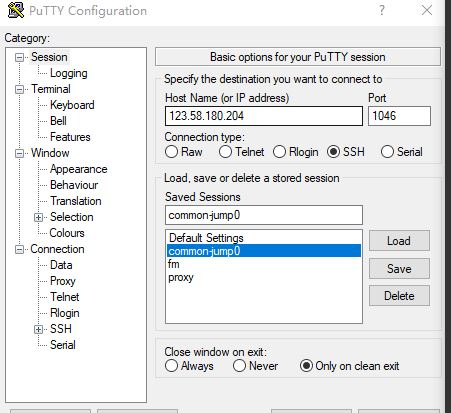

## charles抓包

http：
1. 安装Charles
2. 手机和Charles连同一网络
3. Charles菜单proxy开启代理， 手机设置代理
至此，http已经可以抓包

HTTPS：
1. Charles help菜单ssl proxy=>install xx certificate,安装到受信任的根证书目录
2. 手机连接电脑代理，打开Chrome，输入网址：chls.pro/ssl， 安装证书
3. 开启ssl proxying
完毕

## putty

通过putty端口转发

1. Session中填写host和port，表示要登录的机器，选择connection type为ssh

2. 设置登录验证，在Connection-SSH-Auth中，选择秘钥文件，到这里就可以通过putty登录机器了

3. 在Connection-SSH-Tunnels中，可以添加转发规则，包括本地端口，远程ip和端口，就可以端口转发了

### putty登录验证

验证可以通过账号密码或公私钥，公私钥更安全，公钥拷贝到远程服务器，私钥在本地

openssh生成的公私钥格式和putty格式不同，需要使用puttygen转换，将私钥进行转换后，在Auth中选择

https://devops.ionos.com/tutorials/use-ssh-keys-with-putty-on-windows/#connect-to-server-with-private-key

### 端口转发

https://blog.fundebug.com/2017/04/24/ssh-port-forwarding/

## switchhost

可以方便的修改host文件

## debug
node --inspect-brk ../rollup/bin/rollup -c rollup.config.js
