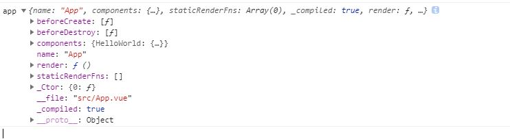

1. import App from './App.vue' 这样import进来的APP是什么

APP既不是文件里写的object，也不是构造函数，而是处理过的Object

2. render中的h函数接受的参数可以是什么？除了字符串指定内置标签，字符串指定com破nent，为什么可以这样写,
```javascript
new Vue({
  render: h => h(App),
})
```
为啥可以直接传App，传App进去，new出来的实例究竟是什么，为什么可以传一个component进去，new出component的实例
h函数对字符串和对象做了不同处理

3. 通过下面两种方式生成组件有什么不同
```javascript
import App from '...'

const vm = new Vue({
  render: h => h(App)
}).mount('#app')

const ctor = Vue.extend(App)
const vm = new ctor()
vm.mount('#app')
```
第一种方法有两个vue实例，第二个vue实例时APP对应的VNOde的componentInstance

4. 组件时怎样挂载到父组件上的
子组件对应的Vue实例记录了elm，createComponent后会将这个dom放到父组件中占位的vnode上，而创建这个vnode的elem后期会将这个elm插入父节点

5. inject/provide是怎么处理的
当生成子组件时会将当前vue实例作为参数传入组件构造函数作为子组件vue实例的$parent属性，
处理provide属性就是把它放到_provided,处理inject就是沿着链条向上_provided寻找，将找到的放到VM实例上，并且变成响应式

6. 全局混入mixin是什么，混哪里去了，beforeCreate在哪执行
mixin直接在Vue上挂载东西了,创建vue实例时，会将Vue构造函数上的options拷贝到VM实例上，然后在处理数据之前会调用beforeCreate钩子函数

7. 属性样式是怎么处理的，虚拟dom长啥样
生成的render函数中attrs，on事件都会放到vnode的data中,
原生tag在处理完createChildren后，会invokeCreateHooks


8. 插槽怎么处理
插槽关键在parentVnode和parentVnode的context，context指的是vnode所在的vm实例

9. $root是什么
$root是根vue实例，全局唯一

10. vuex getter的实现

11. vue router嵌套路由

12. defineReactive为啥传val，set方法为什么对val赋值
闭包，值变了

13. 动态添加删除，数组增加是如何保证响应式的
调用了defineReactive，object是目标对象，key是新增的


